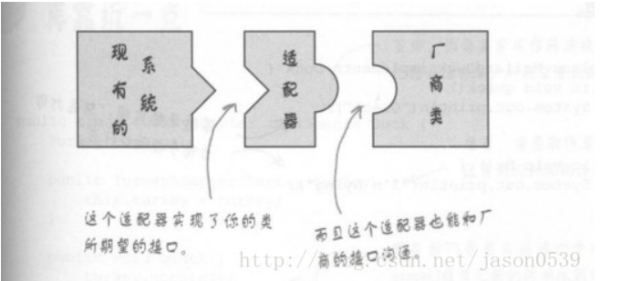
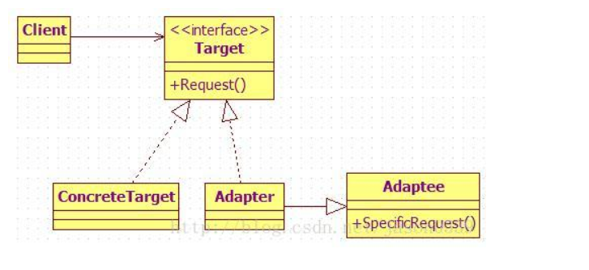

# 适配器模式

## 引入

接口不同而不能交互的类总是不能一起工作, 适配器模式专门解决这个问题

适配器模式是补救措施，所以不要主动使用这个模式

分类:

1. 实现方式
	1.1 类适配器-----采用继承的方式
	1.2 对象适配器---采用组合方式
2. 使用目的
	2.1 特殊适配器---复用原来的代码并适配当前接口
	2.2 缺省适配器---提供缺省的实现，避免子类实现多余的方法


## 定义

将一个接口转换成客户希望的另一个接口，适配器模式使接口不兼容的那些类可以一起工作




## 结构



## 代码分析

类适配器(adapter既继承了被适配类, 也实现了目标标准接口)

```java
// 待适配类, 已存在的、具有特殊功能、希望被重用, 但不符合我们既有的标准接口
class Adaptee {
	public void specificRequest() {
		System.out.println("被适配类具有 特殊功能...");
	}
}

// 目标接口，或称为标准接口
interface Target {
	public void request();
}

// 具体目标类，但是只提供普通功能
class ConcreteTarget implements Target {
	public void request() {
		System.out.println("普通类 具有 普通功能...");
	}
}
 
// 适配器类，继承了被适配类，同时实现标准接口
class Adapter extends Adaptee implements Target{
	public void request() {
		super.specificRequest();
	}
}
 
// 测试类public class Client {
	public static void main(String[] args) {
		// 使用普通功能类
		Target concreteTarget = new ConcreteTarget();
		concreteTarget.request();
		
		// 使用特殊功能类，即适配类
		Target adapter = new Adapter();
		adapter.request();
	}
}
```

对象适配器

```java
// 适配器类，直接关联被适配类，同时实现标准接口
class Adapter implements Target{
	// 直接关联被适配类
	private Adaptee adaptee;
	
	// 可以通过构造函数传入具体需要适配的被适配类对象
	public Adapter (Adaptee adaptee) {
		this.adaptee = adaptee;
	}
	
	public void request() {
		// 这里是使用委托的方式完成特殊功能
		this.adaptee.specificRequest();
	}
}

// 测试类
public class Client {
	public static void main(String[] args) {
		// 使用普通功能类
		Target concreteTarget = new ConcreteTarget();
		concreteTarget.request();
		
		// 使用特殊功能类，即适配类，
		// 需要先创建一个被适配类的对象作为参数
		Target adapter = new Adapter(new Adaptee());
		adapter.request();
	}
}
```


## 模式分析

优点:

*   将目标类和被适配类解耦，通过引入一个适配器类重用现有的被适配类，而无需修改原有代码

## 适用场景

*   系统需要使用现有的类，而这些类的接口不符合系统的接口
*   使用第三方组件，组件接口定义和自己定义的不同，不希望修改自己的接口，但是要使用第三方组件接口的功能

## 实例

例子：java.io.InputStreamReader(InputStream) 
可以将任何InputStream类(如文本流，网络流，内存流)的接口(InputStream)转换成用户希望的Reader抽象类(接口)(InputStreamReader)。可以使得那些原本不兼容Stream但是接受Reader而的组件可以正常工作。

## 总结

•	设计原则：遵循开闭原则、体现功能复用 
•	常用场景：需要使用一个类的功能，但是该类的接口不符合使用场合要求的接口，可使用定制适配器，又或者是有一个接口定义的行为过多，则可以定义一个缺省适配器，让子类选择性的覆盖适配器的方法 
•	使用概率：40% 
•	复杂度：中 
•	变化点：无 
•	选择关键点：定制适配器的选择关键点在于是否有更加优良的替代方案，缺省适配器的选择关键点在于接口中的方法是否可以不全部提供，且都有缺省方案 
•	爆炸点：无 
•	相关设计模式 :装饰器模式, 对于适配器模式中的定制适配器与装饰器模式，二者都是使用组合加继承的手段，不同的是，适配器模式的目的在于适配接口，装饰器模式的目的在于动态的添加功能，且可以叠加。 
