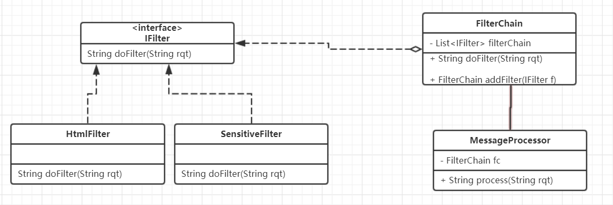
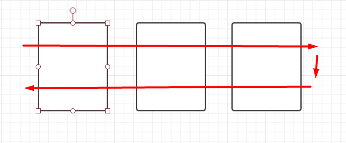
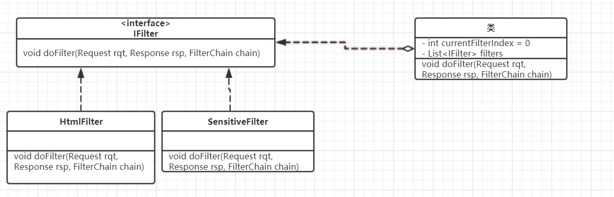

# 责任链模式

## 引入

我们知道, 命令模式可以将请求者和执行者解耦, 客户端需要知道命令的接受者(如:Tv), 在创建命令的时候就把接受者(电视)与命令绑定在一起发送给请求者(电视的遥控器); 现在在命令模式的基础上, 不关心具体的命令/请求执行者, 只是将封装后的命令交给职责链的头部而已, 这就引出职责链模式

>*   链是一系列节点的集合。
>*   链的各节点可灵活拆分再重组。

## 定义

为了避免请求的发送者和接收者之间的耦合关系，使多个接受对象都有机会处理请求。将这些对象连成一条链，并沿着这条链传递该请求，直到有一个对象处理它为止

## 结构



## 代码分析

```java
/**
 * 信息处理接口, 链条上的每个过滤器都实现它
 *
 * @version 0.1
 * @author xy
 * @date 2018年1月26日 下午5:45:12
 */
public interface IFilter {

    /**
     * 处理信息方法
     * @param rqt 输入
     * @return
     */
    String doFilter(String rqt);
}

/***
 * 职责链, 面向处理节点接口编程, 和具体的处理节点没有关系
 *
 * @version 0.1
 * @author xy
 * @date 2018年1月26日 下午6:24:56
 */
public class FilterChain implements IFilter {
    
    private List<IFilter> filterChain =  new ArrayList<IFilter>();
    
    @Override
    public String doFilter(String rqt) {
        for(IFilter f: filterChain) {
            rqt = f.doFilter(rqt);
        }
        return rqt;
    }
    
    /**
     * 添加过滤节点
     * @param filter
     * @return
     */
    public FilterChain addFilter(IFilter filter) {
        this.filterChain.add(filter);
        return this;
    }

}

/**
 * 信息处理器, 封装了职责链, 这里相当与一个外观模式, 封装了内部细节,只提供给外部一个process()
 *
 * @version 0.1
 * @author xy
 * @date 2018年1月26日 下午6:01:33
 */
@Data
public class MessageProcessor {

    /**
     * 封装的职责链
     */
    private FilterChain fc;
    public MessageProcessor(FilterChain fc) {
        this.fc = fc;
    }
    
    public String process(String rqt) {
        return fc.doFilter(rqt);
    }

}

/**
 * 具体的处理节点, 将<>替换为[]
 *
 * @version 0.1
 * @author xy
 * @date 2018年1月26日 下午6:11:58
 */
public class HtmlFilter implements IFilter {

    @Override
    public String doFilter(String rqt) {
        String replace = rqt.replaceAll("<", "[")
                .replaceAll(">", "]");
        return replace;

    }

}

/**
 * 具体的处理节点, 敏感词过滤 将xxx换为yyy
 *
 * @version 0.1
 * @author xy
 * @date 2018年1月26日 下午6:15:37
 */
public class SensitiveFilter implements IFilter {

    @Override
    public String doFilter(String rqt) {
        return rqt.replaceAll("xxx", "yyy");
    }

}

/**
 * 简单职责链模式client
 *
 * @version 0.1
 * @author xy
 * @date 2018年1月26日 下午6:17:51
 */
public class Client {

    public static void main(String[] args) {
        String str = "hhh, xxx :) <script>";
        FilterChain fc = new FilterChain().addFilter(new HtmlFilter()).addFilter(new SensitiveFilter());
        MessageProcessor processor = new MessageProcessor(fc);
        
        String rst = processor.process(str);
        System.out.println(rst);
    }
}
```

## 复杂（请求响应有序）责任链

类比 servlet 中的 filter

请求响应有序 类似这张示意图:



结构:



```java
/**
 * request
 *
 * @version 0.1
 * @author xy
 * @date 2018年1月26日 下午8:09:54
 */
@Data
public class Request {

    private String content;
}

/**
 * response
 *
 * @version 0.1
 * @author xy
 * @date 2018年1月26日 下午8:10:24
 */
@Data
public class Response {

    private String content;
}

/**
 * 节点接口
 *
 * @version 0.1
 * @author xy
 * @date 2018年1月26日 下午8:08:13
 */
public interface IFilter {

    void doFilter(Request rqt, Response rsp, FilterChain chain);
}

/**
 * filter chain
 *
 * @version 0.1
 * @author xy
 * @date 2018年1月26日 下午8:20:58
 */
@Data
public class FilterChain implements IFilter {

    /**
     * 节点执行索引, 初始为0; 表示当前执行到哪个filter了
     */
    private int currentFilterIndex = 0;
    
    /**
     * 过滤节点容器
     */
    private List<IFilter> filters = new ArrayList<IFilter>();
    
    @Override
    public void doFilter(Request rqt, Response rsp, FilterChain chain) {
        // 当 chain 中的 filter 被遍历执行完, 跳出
        if (this.filters.size() == currentFilterIndex) {
            return;
        }
        else {
            IFilter filter = filters.get(currentFilterIndex);
            // 当前节点获取到后, 马上索引移动到下一个, 不然会循环调用, 一直调用第一个filter, 直到系统崩溃
            currentFilterIndex++;
            filter.doFilter(rqt, rsp, chain);
        }
    }
    
    public FilterChain addFilter(IFilter filter) {
        this.filters.add(filter);
        return this;
    }

}

/**
 * html filter
 *
 * @version 0.1
 * @author xy
 * @date 2018年1月26日 下午8:32:39
 */
public class HtmlFilter implements IFilter {

    @Override
    public void doFilter(Request rqt, Response rsp, FilterChain chain) {
        rqt.setContent(
                rqt.getContent().replace("<", "[").replace(">", "]"));
        System.out.println("HtmlFilter: 请求过程中被处理");
        chain.doFilter(rqt, rsp, chain);
        System.out.println("HtmlFilter: 返回过程中被处理");
    }

}


/**
 * sensitive filter
 *
 * @version 0.1
 * @author xy
 * @date 2018年1月26日 下午8:38:58
 */
public class SensitiveFilter implements IFilter {

    @Override
    public void doFilter(Request rqt, Response rsp, FilterChain chain) {
        rqt.setContent(rqt.getContent().replaceAll("xxx", "yyy"));
        System.out.println("SensitiveFilter: 请求过程被处理");
        chain.doFilter(rqt, rsp, chain);
        System.out.println("SensitiveFilter: 返回过程被处理");
    }

}

/**
 * 测试
 *
 * @version 0.1
 * @author xy
 * @date 2018年1月26日 下午8:43:43
 */
public class Client {

    public static void main(String[] args) {
        String str = "hhh, xxx :) <script>, ";
        Request rqt = new Request();
        rqt.setContent(str);
        Response rsp = new Response();
        rsp.setContent("response-content");
        
        FilterChain fc = new FilterChain().addFilter(new HtmlFilter()).addFilter(new SensitiveFilter());
        fc.doFilter(rqt, rsp, fc);
        System.out.println(rsp.getContent());
    }
}

```

## 模式分析

*   各个处理节点有公共的接口
*   可以做成"请求响应有序"的需求, 此时注意防止循环调用

## 实例

*   java.util.logging.Logger#log()
*   Apache Commons Chain
*   javax.servlet.Filter#doFilter()
