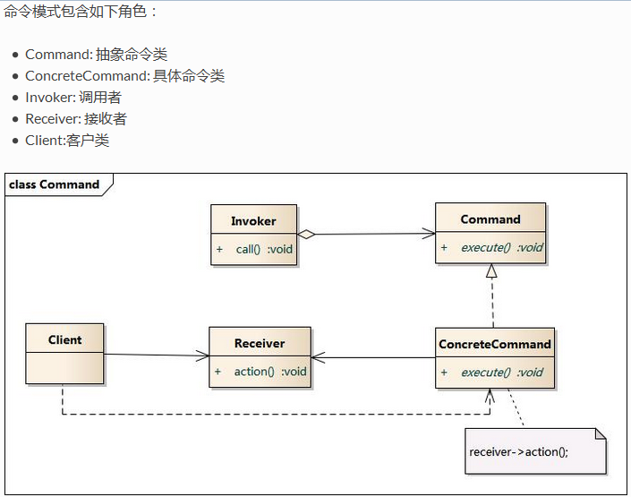
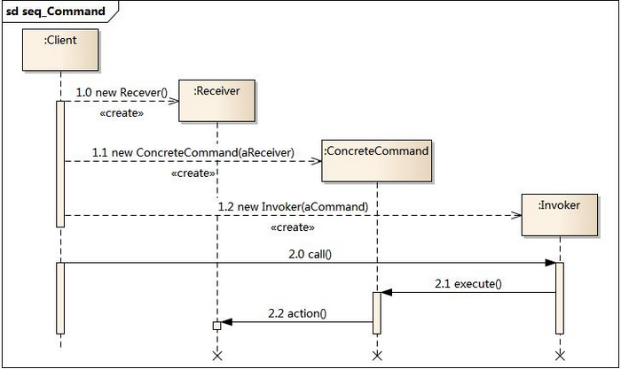

# 命令模式

别名"动作模式", "事务模式"

## 引入

系统设计中, 有时某个对象(命令发出者)发送请求, 但是不关心具体是那个对象接受命令(命令执行者), 也不关心命令背后的操作, 只需要在程序内部指定请求执行者就行了, 分离了发出者和执行者, 两者之间完全解耦, 没有直接引用.

另一个例子: 拿订餐来说，客人需要向厨师发送请求，但是完全不知道这些厨师的名字和联系方式，也不
知道厨师炒菜的方式和步骤。 命令模式把客人订餐的请求封装成 command 对象，也就是订餐中的
订单对象。这个对象可以在程序中被四处传递，就像订单可以从服务员手中传到厨师的手中。这
样一来，客人不需要知道厨师的名字，从而解开了请求调用者和请求接收者之间的耦合关系。

## 定义

将命令(请求)封装为一个对象, 从而可以用不同的命令对目标对象进行各种操作, 分离了命令发出者和执行者;
同时, 可对命令排队, or记录命令日志or支持可撤销的操作

## 结构




## 代码分析

```java
/**
 * command receiver: tv
 *
 * @version 0.1
 * @author xy
 * @date 2018年1月25日 下午6:02:53
 */
public class Tv {

    /**
     * current channel
     */
    private int channel = 0;
    
    /**
     * turn on tv
     */
    public void turnOn() {
        System.out.println("turn on tv.");
    }
    
    /**
     * turn off tv
     */
    public void turnOff() {
        System.out.println("turn off tv.");
    }
    
    /**
     * change tv channel
     * @param channel
     * @return
     */
    public int changeChannel(int channel) {
        this.channel = channel;
        return channel;
    }
    /**
     * show current channel
     * @return
     */
    public int showChannel() {
        return this.channel;
    }
}

/**
 * command interface
 *
 * @version 0.1
 * @author xy
 * @date 2018年1月25日 下午6:02:11
 */
public interface Command<T> {

    void exec();
}

/**
 * command: turn on tv
 *
 * @version 0.1
 * @author xy
 * @date 2018年1月25日 下午6:09:14
 */
public class CommandOn implements Command<Tv> {
    
    private Tv tv;
    
    public CommandOn(Tv tv) {
        this.tv = tv;
    }

    @Override
    public void exec() {
        tv.turnOn();
    }

}

/**
 * command: turn off tv
 *
 * @version 0.1
 * @author xy
 * @date 2018年1月25日 下午6:14:11
 */
public class CommandOff implements Command<Tv> {

    private Tv tv;
    
    public CommandOff(Tv tv) {
        this.tv = tv;
    }
    
    @Override
    public void exec() {
        tv.turnOff();
    }

}

/**
 * command: change tv channel
 *
 * @version 0.1
 * @author xy
 * @date 2018年1月25日 下午6:15:46
 */
public class CommandChangeChannel implements Command<Tv> {
    
    private int channel;
    private Tv tv;
    
    public CommandChangeChannel(Tv tv, int channel) {
        this.channel = channel;
        this.tv = tv;
    }

    @Override
    public void exec() {
        tv.changeChannel(channel);
    }

}

/**
 * invoker, 可以看作是遥控器, 命令发送者;
 * 它和tv, 即命令接受者完全解耦
 *
 * @version 0.1
 * @author xy
 * @date 2018年1月25日 下午6:22:35
 */
public class Controller {

    private Command<?> cmdOn;
    private Command<?> cmdOff;
    private Command<?> cmdChangeChannel;
    
    public Controller(Command<?> cmdOn, Command<?> cmdOff, Command<?> change) {
        this.cmdOn = cmdOn;
        this.cmdOff = cmdOff;
        this.cmdChangeChannel = change;
    }
    
    
    public void turnOn() {
        cmdOn.exec();
    }
    
    public void turnOff() {
        cmdOff.exec();
    }
    
    public void changeChannel() {
        cmdChangeChannel.exec();
    }
    
}

/**
 * client
 *
 * @version 0.1
 * @author xy
 * @date 2018年1月25日 下午6:59:00
 */
public class Person {

    public static void main(String[] args) {
        Tv tv = new Tv();
        //----------------------------准备工作, 准备遥控器-----------------------------------
        Command<?> cmdOn = new CommandOn(tv);
        Command<?> cmdOff = new CommandOff(tv);
        Command<?> change = new CommandChangeChannel(tv, 2);
        Controller controller = new Controller(cmdOn, cmdOff, change);
        //-----------------------------------准备完毕------------------------------------------------
        // 此时controller和tv是完全分离的
        controller.turnOn();
        controller.changeChannel();
        System.out.println("current channel: " + tv.showChannel());
        controller.turnOff();
    }
}


```

## 模式分析

*   命令模式本质是对命令的封装, 将发出者和执行者分离
*   命令模式关键在于引入了抽象命令接口, 且发送者针对命令接口编程, 只有实现了抽象命令接口的具体命令才能与命令接收者关联

优点:

*   解耦
*   新的命令加入系统很容易
*   可以很容易的设计一个命令队列or命令组合(宏命令)
*   可以方便的设计命令的撤销or重做

缺点:

*   具体命令类过多, 因为每一个命令都需要有一个对应的具体命令类

## 适用场景

*   系统需要将请求调用者和请求接受者解耦, 两者不直接交互
*   系统在不同时间发出请求, 需要将请求做成请求队列执行
*   系统需要支持命令撤销or重做
*   系统需要将一组命令组合在一起, 即支持宏命令

## 应用实例

java.lang.Runnable

## 总结

*   设计原则：遵循迪米特、开闭原则
*   常用场景：行为的请求者与行为的处理者耦合度过高
*   使用概率：20%
*   复杂度：中高
*   变化点：命令的种类
*   选择关键点：请求者是否不需要关心命令的执行只知道接受者
*   爆炸点：命令的种类无限制增长
*   相关设计模式
    *   职责链模式：容易将二者关联在一起的原因是，二者都是为了处理请求或者命令而存在的，而且二者都是为了将请求者与响应者解耦，不同的是命令模式中，客户端需要知道一个命令的接受者，在创建命令的时候就把接受者与命令绑定在一起发送给调用者，而职责链模式中，客户端并不关心最终处理请求的对象是谁，客户端只是封装一个请求对象，随后交给职责链的头部而已，也正因为这样，二者的实现方式，有着很大的区别
 