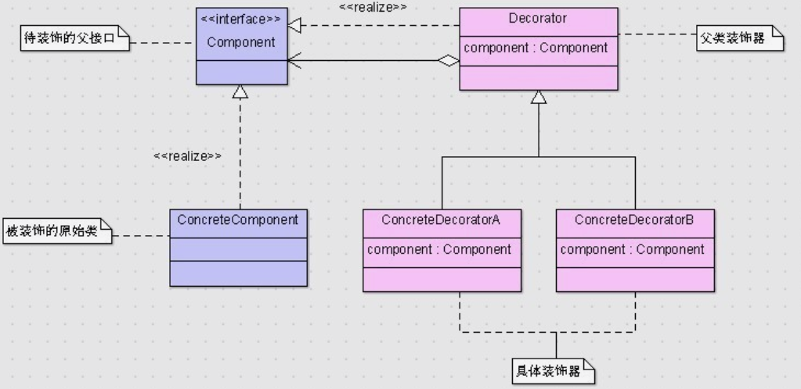

# 装饰器模式(Decorator)

## 引入

希望给一个对象添加行为, 但是又希望这个改动对调用者透明(换言之，客户端并不会觉得对象在装饰前和装饰后有什么不同); 这个和适配器模式相似, 但是有区别: 适配器模式的目的在于适配接口，装饰器模式的目的在于动态的添加功能，且可以叠加。 

一般有两种方式可以实现给一个类或对象增加行为(和 adapter 类似)：

*   继承机制，使用继承机制是给现有类添加功能的一种有效途径，通过继承一个现有类可以使得子类在拥有自身方法的同时还拥有父类的方法。但是这种方法是静态的，用户不能控制增加行为的方式和时机。

*   关联机制，即将一个类的对象嵌入另一个对象中，由另一个对象来决定是否调用嵌入对象的行为以便扩展自己的行为，我们称这个嵌入的对象为装饰器(Decorator)

## 定义

装饰模式(Decorator Pattern) ：动态地给一个对象增加一些额外的职责(Responsibility)，就增加对象功能来说，装饰模式比生成子类实现更为灵活

## 结构



## 代码分析

```java
//待装饰接口
public interface Component {
    void method();
}
//具体待装饰类
public class ConcreteComponent implements Component{
    public void method() {
        System.out.println("原来的方法");
    }
}
//抽象装饰器父类
public abstract class Decorator implements Component{
    protected Component component;
    public Decorator(Component component) {
        super();
        this.component = component;
    }
    public void method() {
        component.method();
    }
}
//具体装饰器类A
public class ConcreteDecoratorA extends Decorator{
    public ConcreteDecoratorA(Component component) {
        super(component);
    }
    public void methodA(){
        System.out.println("被装饰器A扩展的功能");
    }
    public void method(){
        System.out.println("针对该方法加一层A包装");
        super.method();
        System.out.println("A包装结束");
    }
}
//具体装饰器类B
public class ConcreteDecoratorB extends Decorator{
    public ConcreteDecoratorB(Component component) {
        super(component);
    }
    public void methodB(){
        System.out.println("被装饰器B扩展的功能");
    }
    public void method(){
        System.out.println("针对该方法加一层B包装");
        super.method();
        System.out.println("B包装结束");
    }
}

```

## 模式分析

*   使用装饰模式来实现扩展比继承更加灵活，它以对客户透明的方式动态地给一个对象附加更多的责任。装饰模式可以在不需要创造更多子类的情况下，将对象的功能加以扩展。
*   尽量保持具体构件类Component作为一个“轻”类，也就是说不要把太多的逻辑和状态放在具体构件类中，可以通过装饰类

优点:

*   装饰模式可以提供比继承更多的灵活性。(继承是一种耦合度较大的静态关系，无法在程序运行时动态扩展)
*   可以通过一种动态的方式来扩展一个对象的功能，通过配置文件可以在运行时选择不同的装饰器，从而实现不同的行为。
*   通过使用不同的具体装饰类以及这些装饰类的排列组合，可以创造出很多不同行为的组合。可以使用多个具体装饰类来装饰同一对象，得到功能更为强大的对象。
*   体构件类与具体装饰类可以独立变化，用户可以根据需要增加新的具体构件类和具体装饰类，在使用时再对其进行组合，原有代码无须改变，符合“开闭原则”

缺点:

*   这种比继承更加灵活机动的特性, 难于debug

## 适用场景

选择关键点：添加的功能是否需要动态组装 

*   在不影响其他对象的情况下，以动态、透明的方式给单个对象添加职责。
*   需要动态地给一个对象增加功能，这些功能也可以动态地被撤销。
*   当不能采用继承的方式对系统进行扩充或者采用继承不利于系统扩展和维护时。不能采用继承的情况主要有两类：第一类是系统中存在大量独立的扩展，为支持每一种组合将产生大量的子类，使得子类数目呈爆炸性增长；第二类是因为类定义不能继承（如final类）.

## 实例

java.io.BufferedInputStream(InputStream) , 和适配器有类似

servlet 中的 HttpServletRequestWrapper
