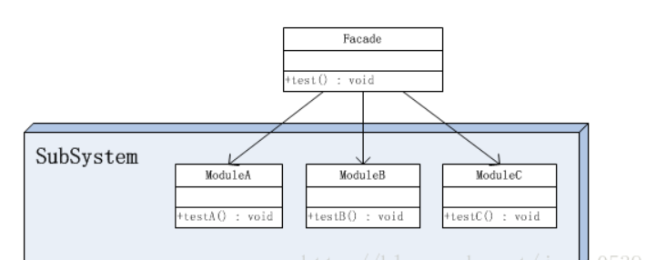

# 外观模式

## 引入

希望屏蔽复杂的子系统接口, 只提供简单的使用接口给外部.

## 定义

为子系统中的一组接口提供一个一致的界面，Facade模式定义了一个高层接口，这个接口使得这一子系统更加容易使用。

## 结构



## 代码分析

```java
public class ModuleA {  
    //示意方法  
    public void testA(){  
        System.out.println("调用ModuleA中的testA方法");  
    }  
}  

public class ModuleB {  
    //示意方法  
    public void testB(){  
        System.out.println("调用ModuleB中的testB方法");  
    }  
}  

public class ModuleC {  
    //示意方法  
    public void testC(){  
        System.out.println("调用ModuleC中的testC方法");  
    }  
}  

public class Facade {  
    //示意方法，满足客户端需要的功能  
    public void test(){  
        ModuleA a = new ModuleA();  
        a.testA();  
        ModuleB b = new ModuleB();  
        b.testB();  
        ModuleC c = new ModuleC();  
        c.testC();  
    }  
}  

测试:
public class Client {  
  
    public static void main(String[] args) {  
          
        Facade facade = new Facade();  
        facade.test();  
    }  
  
}  
```

## 模式分析

*   一个系统可以有几个门面类, 但是一个子系统只能有一个门面类

优点:

*   能够有选择性地暴露方法。一个模块中定义的方法可以分成两部分，一部分是给子系统外部使用的，一部分是子系统内部模块之间相互调用时使用的。有了Facade类，那么用于子系统内部模块之间相互调用的方法就不用暴露给子系统外部了。


## 适用场景


## 实例


## 总结

*   设计原则：遵循迪米特
*   常用场景：一个子系统需要对外提供服务
*   使用概率：60%
*   复杂度：中
*   变化点：无
*   选择关键点：子系统对外提供服务是否需要依赖很多的类
*   爆炸点：子系统对外提供的服务的变化或子系统本身的不稳定
*   相关设计模式
    *   中介者模式：二者都是为了处理复杂的耦合关系，不同的是外观模式处理的是类之间复杂的依赖关系，中介者模式处理的是对象之间复杂的交互关系