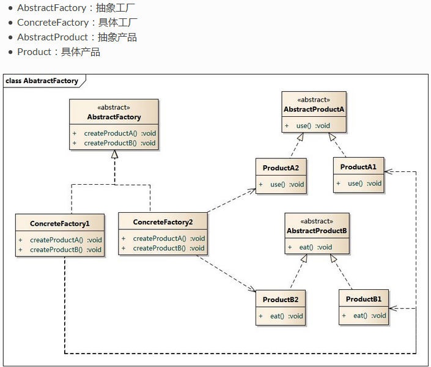

# 抽象工厂模式

## 引入

在工厂方法模式中每一个具体工厂对应一种具体产品。每一个具体工厂中只有一个工厂方法。或者一组重载的工厂方法。但是有时候我们需要一个工厂可以提供一组对象,(这组对象各不相同, 不属于一个继承体系), 而不是单一的产品对象(or对象组), 此时有必要引入抽象工厂模式.

## 定义

提供这样一个接口, 能够创建一系列相关or相互依赖的对象而不必指定这些对象具体的类

## 结构




## 代码分析

```java
/**
 * factory interface
 *
 * @version 0.1
 * @author xy
 * @date 2018年1月25日 下午3:08:47
 */
public interface IFactory {

    AbsProductA getProdA();
    AbsProductB getProdB();
}

/**
 * abstract productA
 *
 * @version 0.1
 * @author xy
 * @date 2018年1月25日 下午3:12:00
 */
public abstract  class AbsProductA {

    public abstract void use();
}

/**
 * abstract productB
 *
 * @version 0.1
 * @author xy
 * @date 2018年1月25日 下午3:14:45
 */
public abstract class AbsProductB {

    public abstract void eat();
}

/**
 * concrete product A1
 *
 * @version 0.1
 * @author xy
 * @date 2018年1月25日 下午3:19:21
 */
public class ProductA1 extends AbsProductA {

    @Override
    public void use() {
        System.out.println("ProductA1: use()");
    }

}

/**
 * concrete product B1
 *
 * @version 0.1
 * @author xy
 * @date 2018年1月25日 下午3:21:00
 */
public class ProductB1 extends AbsProductB {

    @Override
    public void eat() {
        System.out.println("ProductB1: eat()");
    }

}

/**
 * concrete factory 1
 *
 * @version 0.1
 * @author xy
 * @date 2018年1月25日 下午3:16:03
 */
public class Factory1 implements IFactory {

    @Override
    public AbsProductA getProdA() {
        return new ProductA1();
    }

    @Override
    public AbsProductB getProdB() {
        return new ProductB1();
    }

}

/**
 * concrete product A2
 *
 * @version 0.1
 * @author xy
 * @date 2018年1月25日 下午3:23:41
 */
public class ProductA2 extends AbsProductA {

    @Override
    public void use() {
        System.out.println("ProductA2: use()");
    }

}

/**
 * concrete product B2
 *
 * @version 0.1
 * @author xy
 * @date 2018年1月25日 下午3:24:50
 */
public class ProductB2 extends AbsProductB {

    @Override
    public void eat() {
        System.out.println("ProductB2: eat()");
    }

}

/**
 * concrete factory2
 *
 * @version 0.1
 * @author xy
 * @date 2018年1月25日 下午3:23:05
 */
public class Factory2 implements IFactory {

    @Override
    public AbsProductA getProdA() {
        return new ProductA2();
    }

    @Override
    public AbsProductB getProdB() {
        return new ProductB2();
    }

}

/**
    测试
*/
public class Client {

    public static void main(String[] args) {
        IFactory fac1 = new Factory1();// 隔离了具体类, client无需知道是哪个具体类被生成, 只需知道是那个具体工厂即可
        AbsProductA A1 = fac1.getProdA();
        AbsProductB B1 = fac1.getProdB();
        A1.use();
        B1.eat();
        
        IFactory fac2 = new Factory2();
        AbsProductA A2 = fac2.getProdA();
        AbsProductB B2 = fac2.getProdB();
        A2.use();
        B2.eat();
    }
}

```

## 模式分析

优点:

*   抽象工厂模式隔离了具体类的生成, 客户端并不知道哪个具体类被创建。此时更换具体工程变得很容易。可以很容易改变整个软件系统的行为
*   当不在一个继承体系中的多个对象被设计在一起工作时, 抽象工厂模式能够保证客户端始终只使用同一个产品组中的对象。
*   符合开闭原则

缺点:

*   开闭原则支持的不是很好, 增加新的工厂和产品族容易, 增加爱新的产品等级结构(继承体系)麻烦

## 使用场景

*   一个系统不应当依赖于产品类实例如何被创建组合等等细节.这对于所有类型的工程模式都适用。
*   系统中有多于一个的产品族，而且每次只使用其中一个产品族。属于同一产品族的产品将在一起使用

## 应用实例

例如, 一个系统需要更换界面主题, 要求界面中的按钮, 文本框, 背景色, 等等元素一起改变, 可以将这些元素放到同一个工厂.

## 总结

*	设计原则：遵循单一职责、依赖倒置、开闭原则 
*	常用场景：需要一个接口可以提供一个产品族，且不必知道产品的具体种类 
*	使用概率：30% 
*	复杂度：中 
*	变化点：工厂与产品的种类 
*	选择关键点：产品族是否需要一起提供，且是否有一致的接口 
*	爆炸点：无 
*	相关设计模式 
    *	建造者模式：两者都是建造一批对象或者说产品，不同的是两者的目的和实现手段，在建造者模式中，是为了复用对象的构建过程而定义了一个指挥者，而在抽象工厂模式中，是为了提供一个这批对象的创建接口而定义了抽象工厂接口。 

三个工厂相关模式区别：

*   首先从简单工厂进化到工厂方法，是因为工厂方法弥补了简单工厂对修改开放的弊端，即简单工厂违背了开闭原则。
*   从工厂方法进化到抽象工厂，是因为抽象工厂弥补了工厂方法只能创造一个系列的产品的弊端(只能创建同一个继承体系产品)。


此外, 工厂模式还有一个巨大优点, 方便拓展外部组建, 如果有一个第三方jar包，我们自己要拓展他的功能：

```java
//抽象产品
interface Product{}
//具体产品
class ProductA implements Product{}
class ProductB implements Product{}
//工厂接口
interface Factory{
    Product getProduct();
}
//具体的工厂A，创造产品A
class FactoryA implements Factory{
    public Product getProduct() {
        return new ProductA();
    }
}
//具体的工厂B，创造产品B
class FactoryB implements Factory{
    public Product getProduct() {
        return new ProductB();
    }
}
/*   假设以上是一个第三方jar包中的工厂方法模式，我们无法改动源码   */
//我们自己特有的产品
interface MyProduct{}
//我们自己特有的产品实现
class MyProductA implements MyProduct{}
class MyProductB implements MyProduct{}
//我们自己的工厂接口
interface MyFactory{
    MyProduct getMyProduct();
}
//我们自己特有的工厂A，产生产品A
class MyFactoryA implements MyFactory{
    public MyProduct getMyProduct() {
        return new MyProductA();
    }
}
//我们自己特有的工厂B，产生产品B
class MyFactoryB implements MyFactory{
    public MyProduct getMyProduct() {
        return new MyProductB();
    }
}
/*  到这里是我们自己的一套工厂方法模式，去创造我们自己的产品，以下我们将以上二者组合   */
//我们使用组合的方式将我们的产品系列和jar包中的产品组合起来, 即新建一个组合工厂, 继承我们自己原有工厂接口and第三方组建接口
class AssortedFactory implements MyFactory,Factory{
    MyFactory myFactory;
    Factory factory;
    public AssortedFactory(MyFactory myFactory, Factory factory) {
        super();
        this.myFactory = myFactory;
        this.factory = factory;
    }
    public Product getProduct() {
        return factory.getProduct();
    }
    public MyProduct getMyProduct() {
        return myFactory.getMyProduct();
    }
}

```
