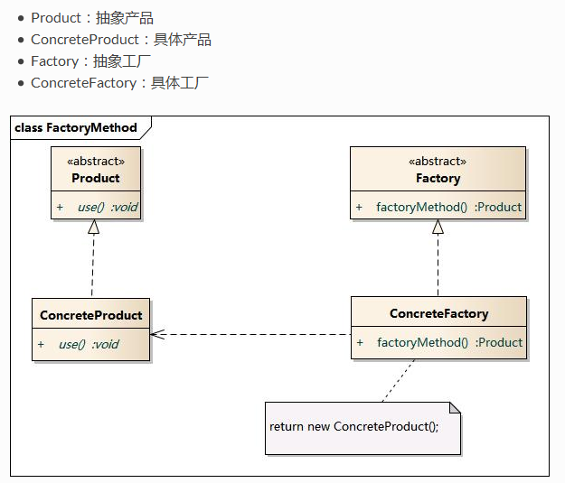
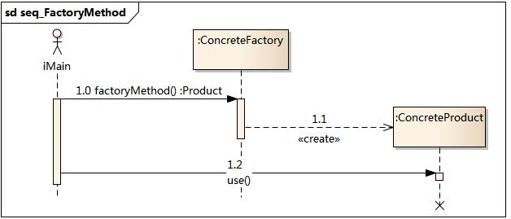
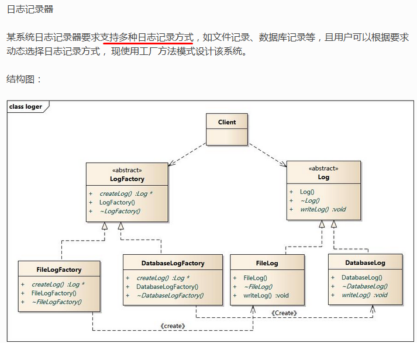

# 工厂方法模式

## 动机

针对简单工厂的缺点

>*   所有的逻辑都在工厂类中。一旦工厂内不能工作，整个系统均受影响。
>*   系统拓展困难。添加新的产品，最后必须修改工厂逻辑

进行改进, 不再设计一个工厂类来负责所有的实例创建, 而是将具体实例A交给具体工厂A创建, 具体实例B交给具体工厂B创建. 这种改进的结果是可以在不修改具体工厂类的情况下引入新的产品。如果出现新的产品类型。只需要为这种新的类型，新建一个具体工厂类

## 定义

工厂方法模式又称为, 虚拟构造器模式。工厂父类负责定义创建产品对象的公共接口。而工厂子类则负责生成具体的产品对象。将产品的实例化操作延迟到工厂子类中完成

## 结构

<br/>



## 代码分析

```java
//测试
public class Client {

	public static void main(String[] args) {
        IFactory facA = new FactoryA();
        IProduct proAA = facA.createProduct("aa");
        proAA.use();
        IProduct proAB = facA.createProduct("AB");
        proAB.use();
        
		
		IFactory facB = new FactoryB();
		facB.createProduct("ba").use();
		facB.createProduct("BB").use();
	}
}
//工厂接口
public interface IFactory {
	public IProduct createProduct(String type);
}

//具体工厂A
public class FactoryA implements IFactory {
	@Override
	public IProduct createProduct(String type) {
        if("aa".equalsIgnoreCase(type)) {
        	return new ProductAA();
        }else if("AB".equalsIgnoreCase(type)) {
        	return new ProductAB();
        }else {
        	return null;
        }
	}

}

//具体工厂A生产的产品A
public class ProductAA implements IProduct {

	@Override
	public void use() {
        System.out.println("productAA is used!");
	}

}
//具体工厂A生产的产品B
public class ProductAB implements IProduct {

	@Override
	public void use() {
        System.out.println("productAB is used!");
	}

}

因业务需求，新增工厂B，代码改动
//新增具体工厂B
public class FactoryB implements IFactory {

	@Override
	public IProduct createProduct(String type) {
		if("ba".equalsIgnoreCase(type)) {
			return new ProductBA();
		}else if("BB".equalsIgnoreCase(type)) {
			return new ProductBB();
		}
		return null;
	}

}
//工厂B生产产品BA
public class ProductBA implements IProduct {

	@Override
	public void use() {
		System.out.println("productBA is used!");
	}

}

//工厂B生产的产品BB
public class ProductBB implements IProduct {

	@Override
	public void use() {
		System.out.println("productBB is used!");

	}

}


```

## 模式分析

*   工厂方法模式是简单工厂模式的进一步抽象。并且克服了他的缺点, 将具体的创建工作交给工厂子类去做。工厂抽象类仅仅负责给出创建产品必须的接口。使得系统在不修改工厂角色的情况下引入新产品。符合了开闭原则
*   使用多个重载的工厂方法: 在抽象工厂角色中可以定义多个工厂方法。这些方法可以包含不同的业务逻辑以满足不同产品对象的需求。
*   产品对象的重复使用: 工厂将已经创建过的对象存储到一个集合中。然后根据客户端对产品的请求对集合进行查询。如果满足查询请求则返回，如果不满足。创建新的对象。然后将该对象返回到客户端。
*   当只有一个具体工厂时那么便发生退化变为简单工厂模式

优点:

首先具有简单工厂的优点

*   对象的创建和消费实现了分离
*   知道参数, 即可创建对象实例, 简单

此外修复了简单工厂缺点

*   所有的逻辑都不在同一个工厂类中。一旦一个工厂类不能工作，整个系统不受影响。
*   系统拓展容易。添加新的产品，无须修改原有工厂逻辑, 只需新增产品类和对应工厂类

缺点:

* 添加新产品时, 需要一个产品类, 和对应的工厂类, 类文件个数将成对增加, 复杂

## 使用场景

*   客户端只知道具体工厂类和产品参数
*   将创建对象的任务委托给多个工厂子类中的一个, client无需关心到底是哪个工厂子类, 需要时再动态指定,   可以将工厂子类的类名存储在配置文件中or数据库中

## 应用实例




## 总结

*	设计原则：遵循单一职责、依赖倒置、开闭原则 
*	常用场景：一种场景是希望工厂与产品的种类对客户端保持透明，给客户端提供一致的操作，另外一种是不同的工厂和产品可以提供客户端不同的服务或功能 
*	使用概率：60% 
*	复杂度：中低 
*	变化点：工厂与产品的种类 
*	选择关键点：工厂类和产品类是否是同生同灭的关系 
*	爆炸点：无 
*	相关设计模式 
    *   抽象工厂模式：工厂方法模式与抽象工厂模式最大的区别在于，在工厂方法模式中，工厂创造的是一个产品，而在抽象工厂模式中，工厂创造的是一个产品族
