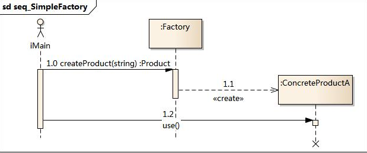

# 简单工厂模式

## 定义

简单工厂模式又称为静态工厂模式。可以根据传入参数的不同返回不同的事例。该模式专门定义一个类来创建其他类的实例。被创建实例的类，通常具有共同的父类.

## 结构

简单工厂模式包含如下角色:

*   factory 工厂角色: 负责创建实例的所有逻辑
*   product 抽象产品角色: 所有待创建对象的父类
*   concreteProduct 具体产品角色: 创建目标类

类图


时序图



## 代码分析

```java
public class Factory {

	public static IProduct getInstance(String type) {
		if ("A".equalsIgnoreCase(type)) {
            return new ConcreteProductA();
			
		}else if("B".equalsIgnoreCase(type)) {
			return new ConcreteProductB();
		}
		
		return null;
	}
}


// 产品接口
public interface IProduct {
	//产品统一接口
	public void use();
}

// 具体产品A
public class ConcreteProductA implements IProduct {

	public void use() {
        System.out.println("A---------use()");
	}

}

// 具体产品B
public class ConcreteProductB implements IProduct {

	public void use() {
        System.out.println("B---------use()");
	}

}

// 测试：
public class Client {
    public static void main(String[] args) {
		IProduct productA = Factory.createProduct("a");
		IProduct productB = Factory.createProduct("B");
		productA.use();
		productB.use();
	}
}


```

## 模式分析

*   将对象的创建过程和对象本身业务处理分离。可以降低系统的耦合度。
*   在实际开发中还可以将传入的参数保存在配置文件中。修改参数时无需改动源码。
*   简单工厂模式的要点在于: 当你需要什么，只需要传入一个正确的参数就可以获取需要的对象而不必知道创建细节
*   工厂方法模式：工厂方法模式是简单工厂模式的进一步抽象化，在这两者之间做选择，主要看将工厂进一步抽象化是否有必要，通常情况下，如果工厂的作用仅仅是用来制造产品，则没必要使用工厂方法模式

优点:

*   对象的创建和消费实现了分离
*   知道参数, 即可创建对象实例, 简单

缺点:

*   所有的逻辑都在工厂类中。一旦工厂内不能工作，整个系统均受影响。
*   系统拓展困难。添加新的产品，最后必须修改工厂逻辑

## 使用场景

选择关键点：一种产品是否可根据某个参数决定它的种类 

*   工厂类负责创建的对象较少, 不会造成工厂方法太过复杂
*   客户端只知道传入参数, 对于是什么对象不关心

## 应用实例

JDBC连接数据库，Sun当年提供了一个公共接口，各种数据库需要实现该接口

java.text.DateFormat(用于格式化一个本地日期or时间)
