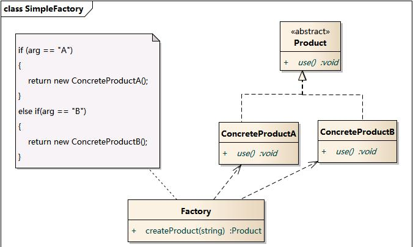

# 简单工厂模式

## 引入

编程中，通常通过new字符创建一个对象, 但是如果创建的是一个特别复杂的对象。创建他需要一系列步骤。他可能需要计算对象的初始设置。选择生成哪个对象实例。此时新建一个对象是一个过程。不仅仅是一个操作. 我们希望创建对象时候不必关心创建的复杂过程, 只需要知道表示该实例的一个参数, 因此通过建立一个对象工厂, 提供一个调用方便的方法来接受传入参数, 以创建对象.

## 定义

简单工厂模式又称为静态工厂模式。可以根据传入参数的不同返回不同的事例。该模式专门定义一个类来创建其他类的实例。被创建实例的类，通常具有共同的父类.

## 结构

简单工厂模式包含如下角色:

*   factory 工厂角色: 负责创建实例的所有逻辑
*   product 抽象产品角色: 所有待创建对象的父类
*   concreteProduct 具体产品角色: 创建目标类

类图



时序图


## 代码分析

```java
public class Factory {

	public static IProduct getInstance(String type) {
		if ("A".equalsIgnoreCase(type)) {
            return new ConcreteProductA();
			
		}else if("B".equalsIgnoreCase(type)) {
			return new ConcreteProductB();
		}
		
		return null;
	}
}


产品接口
public interface IProduct {

	//产品统一接口
	public void use();
}

具体产品A
package com.xy.simplefactory;

public class ConcreteProductA implements IProduct {

	public void use() {
        System.out.println("A---------use()");
	}

}

具体产品B
public class ConcreteProductB implements IProduct {

	public void use() {
        System.out.println("B---------use()");
	}

}

测试：
public class Client {
    public static void main(String[] args) {
		IProduct productA = Factory.createProduct("a");
		IProduct productB = Factory.createProduct("B");
		productA.use();
		productB.use();
	}
}


```

## 模式分析

*   将对象的创建过程和对象本身业务处理分离。可以降低系统的耦合度。
*   在实际开发中还可以将传入的参数保存在配置文件中。修改参数时无需改动源码。
*   该模式最大的问题在于工厂的职责相对过重。增加新的产品需要修改工厂内的判断逻辑, 这没有遵循开闭原则。
*   简单工厂模式的要点在于: 当你需要什么，只需要传入一个正确的参数就可以获取需要的对象而不必知道创建细节

优点:

*   对象的创建和消费实现了分离
*   知道参数, 即可创建对象实例, 简单

缺点:

*   所有的逻辑都在工厂类中。一旦工厂内不能工作，整个系统均受影响。
*   系统拓展困难。添加新的产品，最后必须修改工厂逻辑

## 使用场景

*   工厂类负责创建的对象较少, 不会造成工厂方法太过复杂
*   客户端只知道传入参数, 对于是什么对象不关心

## 应用实例

JDBC连接数据库，Sun当年提供了一个公共接口，各种数据库需要实现该接口

java.text.DateFormat(用于格式化一个本地日期or时间)

## 总结

*	设计原则：遵循单一职责、违背开闭原则 
*	常用场景：需要在一堆产品中选择其中一个产品 
*	使用概率：99.99999% 
*	复杂度：低 
*	变化点：产品的种类 
*	选择关键点：一种产品是否可根据某个参数决定它的种类 
*	爆炸点：工厂类不能正常工作 
*	相关设计模式 
    * 工厂方法模式：工厂方法模式是简单工厂模式的进一步抽象化，在这两者之间做选择，主要看将工厂进一步抽象化是否有必要，通常情况下，如果工厂的作用仅仅是用来制造产品，则没必要使用工厂方法模式。 

