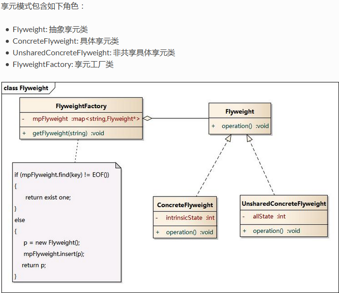
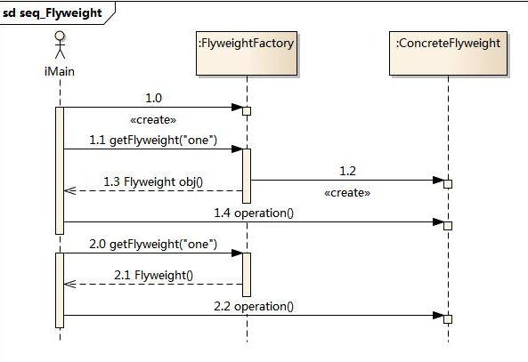

# 享元模式

## 引入

当系统中有大量相同或相似的对象, 将导致系统资源的浪费, 享元模式解决了这个问题

## 定义

在一个系统中如果有多个相同的对象，那么只共享一份就可以了，不必每个都去实例化一个对象。

*   在享元模式中可以共享的相同内容称为内部状态(IntrinsicState)，而那些需要外部环境来设置的不能共享的内容称为外部状态(Extrinsic State)，由于区分了内部状态和外部状态，因此可以通过设置不同的外部状态使得相同的对象可以具有一些不同的特征，而相同的内部状态是可以共享的。
*   在享元模式中通常会出现工厂模式，需要创建一个享元工厂来负责维护一个享元池(Flyweight Pool)用于存储具有相同内部状态的享元对象。

## 结构

## 代码分析

## 模式分析

*   享元模式的核心在于享元工厂类，享元工厂类的作用在于提供一个用于存储享元对象的享元池，用户需要对象时，首先从享元池中获取，如果享元池中不存在，则创建一个新的享元对象返回给用户，并在享元池中保存该新增对象。
*   享元对象能做到共享的关键是区分内部状态(Internal State)和外部状态(External State)。
*   内部状态是存储在享元对象内部并且不会随环境改变而改变的状态，因此内部状态可以共享。
*   外部状态是随环境改变而改变的、不可以共享的状态。享元对象的外部状态必须由客户端保存，并在享元对象被创建之后，在需要使用的时候再传入到享元对象内部。一个外部状态与另一个外部状态之间是相互独立的。

优点:

*   可以极大减少内存中对象的数量, 节省内存
*   享元模式的外部状态相对独立，而且不会影响其内部状态，从而使得享元对象可以在不同的环境中被共享。

缺点:

*   享元模式使得系统更加复杂，需要分离出内部状态和外部状态
*   

## 适用场景

*   一个系统有大量相同或者相似的对象，由于这类对象的大量使用，造成内存的大量耗费。
*   用享元模式需要维护一个存储享元对象的享元池，而这需要耗费资源，因此，应当在多次重复使用享元对象时才值得使用享元模式。

## 实例

在JAVA语言中，String类型就是使用了享元模式。String对象是final类型，对象一旦创建就不可改变,在JAVA中字符串常量都是存在常量池中的，JAVA会确保一个字符串常量在常量池中只有一个拷贝。

## 总结

*   设计原则：无
*   常用场景：一些状态相同的对象被大量的重复使用
*   使用概率：90%
*   复杂度：中
*   变化点：无
*   选择关键点：被共享的对象是否可以将外部状态提取出来
*   爆炸点：没有将外部状态提取完全