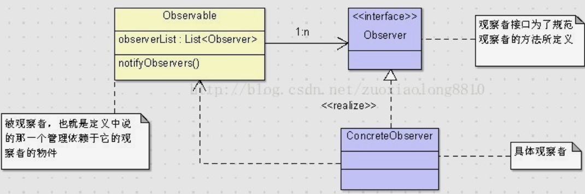
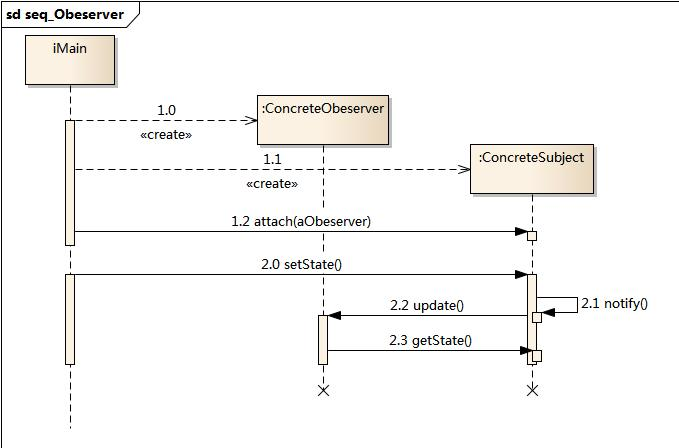
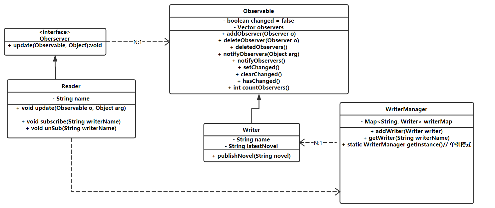

# 观察者模式

别名"发布-订阅模式", "源-监听器模式"

## 引入

需要满足这样一种需求: 一个对象(观察目标)状态发生改变, 需要通知另外一些对象(观察者), 这些对象将做出反应, 一个观察目标可以对应多个观察者, 且观察者间没有联系, 可以随时增删观察者.

## 定义

定义一种对象间的一对多关系, 使得每当一的一方对象状态放生变化, 通知多的一方对象, 

## 结构




## 代码分析

```java
/**
 * 抽象观察者
 *
 * @version 0.1
 * @author xy
 * @date 2018年1月25日 下午9:29:32
 */
public interface IObserver {

    void update(Target t);
}

/**
 * observe target
 *
 * @version 0.1
 * @author xy
 * @date 2018年1月25日 下午11:19:52
 */
public class Target {
    /**
     * observer list
     */
    private List<IObserver> observerList = new ArrayList<IObserver>();

    /**
     * add observer
     * @param observer
     */
    public void add(IObserver observer) {
        observerList.add(observer);
    }
    
    /**
     * remove observer
     * @param observer
     */
    public void remove(IObserver observer) {
        observerList.remove(observer);
    }
    
    /**
     * change status
     */
    public void change() {
        System.out.println("Target状态发生变化");
        this.inform();
    }
    
    /**
     * inform observers
     */
    private void inform() {
        for(IObserver observer: observerList) {
            observer.update(this);
        }
    }
}

/**
 * concrete observer1
 *
 * @version 0.1
 * @author xy
 * @date 2018年1月25日 下午11:42:45
 */
public class Observer1 implements IObserver {

    @Override
    public void update(Target t) {
        System.out.println("Observer1观察到" + t.getClass().getSimpleName()+ "发生变化");
    }

}

/**
 * concrete observer2
 *
 * @version 0.1
 * @author xy
 * @date 2018年1月25日 下午11:45:16
 */
public class Observer2 implements IObserver {

    @Override
    public void update(Target t) {
        System.out.println("Observer2观察到" + t.getClass().getSimpleName() + "发生变化.");
    }

}

/**
 * test
 *
 * @version 0.1
 * @author xy
 * @date 2018年1月25日 下午11:53:28
 */
public class Client {

    public static void main(String[] args) {
        Target t = new Target();
        
        IObserver observer1 = new Observer1();
        IObserver observer2=  new Observer2();
        
        t.add(observer1);
        t.add(observer2);
        
        t.change();
    }
}
```

## 模式分析

*   观察目标和观察者解耦, 同步变化
*   一个观察目标有任意个观察者, 这些观察者派生自同一个接口

优点:

*   符合开闭原则
*   实现表示层and数据层分离, 且可以有各种不同的表示层作为观察者监控数据层的变化

缺点:

*   观察者很多时耗时严重
*   观察者和目标之间有循环依赖, 可能会触发循环调用导致系统崩溃
*   观察者模式无法让观察者知道目标是如何变化的, 仅仅只是知道目标发生了变化


## 适用场景

*   一个对象改变必须通知其他对象, 而不知道这些对象具体名称, 具体个数
*   拓展观察者模式, 创建一个触发链,  A影响b, b影响c.....

## 应用实例

特定节日/商品打折, 通过短信, 邮件, 微信多端发送节日/打折信息

凡是设计到1:1 or 1:N 的对象交互场景均可使用观察者模式

## 总结

•	设计原则：遵循迪米特、开闭原则 
•	常用场景：需要将观察者与被观察者解耦或者是观察者的种类不确定 
•	使用概率：40% 
•	复杂度：中 
•	变化点：观察者的种类与个数 
•	选择关键点：观察者与被观察者是否是多对一的关系 
•	爆炸点：观察者之间有过多的细节依赖 

## jdk中的观察者模式api

jdk中的观察者模式api:

```java
//观察者接口，每一个观察者都必须实现这个接口
public interface Observer {
    //这个方法是观察者在观察对象产生变化时所做的响应动作，从中传入了观察的对象和一个预留参数
    void update(Observable o, Object arg);
}
//被观察者类
public class Observable {
    //这是一个改变标识，来标记该被观察者有没有改变
    private boolean changed = false;
    //持有一个观察者列表
    private Vector obs;
    public Observable() {
		obs = new Vector();
    }
    //添加观察者，添加时会去重
    public synchronized void addObserver(Observer o) {
        if (o == null)
            throw new NullPointerException();
		if (!obs.contains(o)) {
			obs.addElement(o);
		}
    }
    //删除观察者
    public synchronized void deleteObserver(Observer o) {
        obs.removeElement(o);
    }
    //notifyObservers(Object arg)的重载方法
    public void notifyObservers() {
		notifyObservers(null);
    }
    //通知所有观察者，被观察者改变了，你可以执行你的update方法了。
    public void notifyObservers(Object arg) {
        //一个临时的数组，用于并发访问被观察者时，留住观察者列表的当前状态，这种处理方式其实也算是一种设计模式，即备忘录模式。
        Object[] arrLocal;
		//注意这个同步块，它表示在获取观察者列表时，该对象是被锁定的
		//也就是说，在我获取到观察者列表之前，不允许其他线程改变观察者列表
		synchronized (this) {
			//如果没变化直接返回
			if (!changed)
				return;
			//这里将当前的观察者列表放入临时数组
			arrLocal = obs.toArray();
			//将改变标识重新置回未改变
			clearChanged();
		}
        //注意这个for循环没有在同步块，此时已经释放了被观察者的锁，其他线程可以改变观察者列表
        //但是这并不影响我们当前进行的操作，因为我们已经将观察者列表复制到临时数组
        //在通知时我们只通知数组中的观察者，当前删除和添加观察者，都不会影响我们通知的对象
        for (int i = arrLocal.length-1; i>=0; i--)
            ((Observer)arrLocal[i]).update(this, arg);
    }
    //删除所有观察者
    public synchronized void deleteObservers() {
		obs.removeAllElements();
    }
    //标识被观察者被改变过了
    protected synchronized void setChanged() {
		changed = true;
    }
    //标识被观察者没改变
    protected synchronized void clearChanged() {
		changed = false;
    }
    //返回被观察者是否改变
    public synchronized boolean hasChanged() {
		return changed;
    }
    //返回观察者数量
    public synchronized int countObservers() {
        return obs.size();
    }
}

```

尝试着用一下: 示例, 读者（观察者）&作者（被观察者）,

类图是这样的:



```java
//读者类，要实现观察者接口
public class Reader implements Observer{
    private String name;
    public Reader(String name) {
        super();
        this.name = name;
    }
    public String getName() {
        return name;
    }
    //读者可以关注某一位作者，关注则代表把自己加到作者的观察者列表里
    public void subscribe(String writerName){
        WriterManager.getInstance().getWriter(writerName).addObserver(this);
    }
    //读者可以取消关注某一位作者，取消关注则代表把自己从作者的观察者列表里删除
    public void unsubscribe(String writerName){
        WriterManager.getInstance().getWriter(writerName).deleteObserver(this);
    }
    //当关注的作者发表新小说时，会通知读者去看
    public void update(Observable o, Object obj) {
        if (o instanceof Writer) {
            Writer writer = (Writer) o;
            System.out.println(name+"知道" + writer.getName() + "发布了新书《" + writer.getLastNovel() + "》，非要去看！");
        }
    }
}
//作者类，要继承自被观察者类
public class Writer extends Observable{
    private String name;//作者的名称
    private String lastNovel;//记录作者最新发布的小说
    public Writer(String name) {
        super();
        this.name = name;
        WriterManager.getInstance().add(this);
    }
    //作者发布新小说了，要通知所有关注自己的读者
    public void addNovel(String novel) {
        System.out.println(name + "发布了新书《" + novel + "》！");
        lastNovel = novel;
        setChanged();
        notifyObservers();
    }
    public String getLastNovel() {
        return lastNovel;
    }
    public String getName() {
        return name;
    }
}
//管理器，保持一份独有的作者列表
public class WriterManager{
    private Map<String, Writer> writerMap = new HashMap<String, Writer>();
    //添加作者
    public void add(Writer writer){
        writerMap.put(writer.getName(), writer);
    }
    //根据作者姓名获取作者
    public Writer getWriter(String name){
        return writerMap.get(name);
    }
    //单例
    private WriterManager(){}
    public static WriterManager getInstance(){
        return WriterManagerInstance.instance;
    }
    private static class WriterManagerInstance{
        private static WriterManager instance = new WriterManager();
    }
}
//客户端调用
public class Client {
    public static void main(String[] args) {
        //假设四个读者，两个作者
        Reader r1 = new Reader("谢广坤");
        Reader r2 = new Reader("赵四");
        Reader r3 = new Reader("七哥");
        Reader r4 = new Reader("刘能");
        Writer w1 = new Writer("谢大脚");
        Writer w2 = new Writer("王小蒙");
        //四人关注了谢大脚
        r1.subscribe("谢大脚");
        r2.subscribe("谢大脚");
        r3.subscribe("谢大脚");
        r4.subscribe("谢大脚");
        //七哥和刘能还关注了王小蒙
        r3.subscribe("王小蒙");
        r4.subscribe("王小蒙");
        //作者发布新书就会通知关注的读者
        //谢大脚写了设计模式
        w1.addNovel("设计模式");
        //王小蒙写了JAVA编程思想
        w2.addNovel("JAVA编程思想");
        //谢广坤取消关注谢大脚
        r1.unsubscribe("谢大脚");
        //谢大脚再写书将不会通知谢广坤
        w1.addNovel("观察者模式");
    }
}

```

## 观察者模式的另一种形态: 事件驱动模型

eg：例如Tomcat中的监听器listener

两种形态区别：

*   观察者模式中观察者的响应理论上讲针对特定的被观察者是唯一的（说理论上唯一的原因是，如果你愿意，你完全可以在update方法里添加一系列的elseif去产生不同的响应，但LZ早就说过，你应该忘掉elseif），而事件驱动则不是，因为我们可以定义自己感兴趣的事情，比如刚才，我们可以监听作者发布新书，我们还可以在监听器接口中定义其它的行为。再比如tomcat中，我们可以监听servletcontext的init动作，也可以监听它的destroy动作。

*   虽然事件驱动模型更加灵活，但也是付出了系统的复杂性作为代价的，因为我们要为每一个事件源定制一个监听器以及事件，这会增加系统的负担，各位看看tomcat中有多少个监听器和事件类就知道了。

*   另外观察者模式要求被观察者继承Observable类，这就意味着如果被观察者原来有父类的话，就需要自己实现被观察者的功能，当然，这一尴尬事情，我们可以使用适配器模式弥补，但也不可避免的造成了观察者模式的局限性。事件驱动中事件源则不需要，因为事件源所维护的监听器列表是给自己定制的，所以无法去制作一个通用的父类去完成这个工作。

*   被观察者传送给观察者的信息是模糊的，比如update中第二个参数，类型是Object，这需要观察者和被观察者之间有约定才可以使用这个参数。而在事件驱动模型中，这些信息是被封装在Event当中的，可以更清楚的告诉监听器，每个信息都是代表的什么。


针对 读者&作者的例子, 对应的时间驱动模型修改如下:

此时, 作者就是事件源，而读者就是监听器

```java
//定义作者事件这代表了一个作者事件，这个事件当中一般就是包含一个事件源，在这里就是作者
public class WriterEvent extends EventObject{
    private static final long serialVersionUID = 8546459078247503692L;
    public WriterEvent(Writer writer) {
        super(writer);
    }
    public Writer getWriter(){
        return (Writer) super.getSource();
    }
}
//监听器
public interface WriterListener extends EventListener{
    void addNovel(WriterEvent writerEvent);
}
//作者类
// 可以看到，作者类的主要变化是添加了一个自己的监听器列表，我们使用set是为了它的天然去重效果，并且提供给外部注册和注销的方法，与观察者模式相比，这个功能本身是由基类Observable提供的，不过观察者模式中有统一的观察者Observer接口，但是监听器没有，虽说有EventListener这个超级接口，但它毕竟没有任何行为。所以我们一般需要维持一个自己特有的监听器列表。
public class Writer{
    private String name;//作者的名称
    private String lastNovel;//记录作者最新发布的小说
    private Set<WriterListener> writerListenerList = new HashSet<WriterListener>();//作者类要包含一个自己监听器的列表
    public Writer(String name) {
        super();
        this.name = name;
        WriterManager.getInstance().add(this);
    }
    //作者发布新小说了，要通知所有关注自己的读者
    public void addNovel(String novel) {
        System.out.println(name + "发布了新书《" + novel + "》！");
        lastNovel = novel;
        fireEvent();
    }
    //触发发布新书的事件，通知所有监听这件事的监听器
    private void fireEvent(){
        WriterEvent writerEvent = new WriterEvent(this);
        for (WriterListener writerListener : writerListenerList) {
            writerListener.addNovel(writerEvent);
        }
    }
    //提供给外部注册成为自己的监听器的方法
    public void registerListener(WriterListener writerListener){
        writerListenerList.add(writerListener);
    }
    //提供给外部注销的方法
    public void unregisterListener(WriterListener writerListener){
        writerListenerList.remove(writerListener);
    }
    public String getLastNovel() {
        return lastNovel;
    }
    public String getName() {
        return name;
    }
}
// 读者类的变化，首先本来是实现Observer接口，现在要实现WriterListener接口，响应的update方法就改为我们定义的addNovel方法，当中的响应基本没变。另外就是关注和取消关注的方法中，原来是给作者类添加观察者和删除观察者，现在是注册监听器和注销监听器，几乎是没什么变化的。
public class Reader implements WriterListener{
    private String name;
    public Reader(String name) {
        super();
        this.name = name;
    }
    public String getName() {
        return name;
    }
    //读者可以关注某一位作者，关注则代表把自己加到作者的监听器列表里
    public void subscribe(String writerName){
        WriterManager.getInstance().getWriter(writerName).registerListener(this);
    }
    //读者可以取消关注某一位作者，取消关注则代表把自己从作者的监听器列表里注销
    public void unsubscribe(String writerName){
        WriterManager.getInstance().getWriter(writerName).unregisterListener(this);
    }
    public void addNovel(WriterEvent writerEvent) {
        Writer writer = writerEvent.getWriter();
        System.out.println(name+"知道" + writer.getName() + "发布了新书《" + writer.getLastNovel() + "》，非要去看！");
    }
}

```

