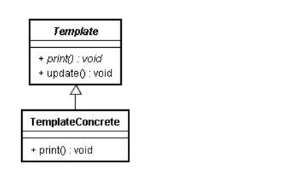

# 模版方法模式

## 引入

定义一个操作中的算法的骨架，而将一些步骤延迟到子类中。TemplateMethod使得子类可以不改变一个算法的结构即可重定义该算法的某些特定步骤

准备一个抽象类，将部分逻辑以具体方法以及具体构造函数的形式实现，然后声明一些抽象方法来迫使子类实现剩余的逻辑。不同的子类可以以不同的方式实现这些抽象方法，从而对剩余的逻辑有不同的实现。这就是模板方法模式的用意。


## 结构



## 代码分析

举个例子，以准备去学校所要做的工作（prepareGotoSchool）为例，假设需要分三步：穿衣服（dressUp），吃早饭（eatBreakfast），带上东西（takeThings）。学生和老师要做得具体事情肯定有所区别。

```java
public abstract class AbstractPerson{  
     //抽象类定义整个流程骨架  
     public void prepareGotoSchool(){  
          dressUp();  
          eatBreakfast();  
          takeThings();  
     }  
     //以下是不同子类根据自身特性完成的具体步骤  
     protected abstract void dressUp();  
     protected abstract void eatBreakfast();  
     protected abstract void takeThings();  
}  

public class Student extends AbstractPerson{  
     @Override  
     protected void dressUp() {  
          System.out.println("穿校服");  
     }  
     @Override  
     protected void eatBreakfast() {  
          System.out.println("吃妈妈做好的早饭");  
     }  
  
     @Override  
     protected void takeThings() {  
          System.out.println("背书包，带上家庭作业和红领巾");  
     }  
}  

public class Teacher extends AbstractPerson{  
     @Override  
     protected void dressUp() {  
          System.out.println("穿工作服");  
     }  
     @Override  
     protected void eatBreakfast() {  
          System.out.println("做早饭，照顾孩子吃早饭");  
     }  
  
     @Override  
     protected void takeThings() {  
          System.out.println("带上昨晚准备的考卷");  
     }  
}  

// 测试
public class Client {  
     public static void main(String[] args) {  
     Student student = new Student()  
     student.prepareGotoSchool();  
  
     Teacher teacher  = new Teacher()  
     teacher.prepareGotoSchool();  
     }  
}  
```

## 模式分析

优点:

*   模板方法模式通过把不变的行为搬移到超类，去除了子类中的重复代码。
*   子类实现算法的某些细节，有助于算法的扩展。
*   通过一个父类调用子类实现的操作，通过子类扩展增加新的行为，符合“开放-封闭原则”。

缺点:

*   每个不同的实现都需要定义一个子类，这会导致类的个数的增加

## 适用场景

在某些类的算法中，用了相同的方法，造成代码的重复。

## 实例


## 总结

*   设计原则：破坏里氏替换，体现功能复用
*   常用场景：一批子类的功能有可提取的公共算法骨架
*   使用概率：80%
*   复杂度：中低
*   变化点：算法骨架内各个步骤的具体实现
*   选择关键点：算法骨架是否牢固
*   爆炸点：无