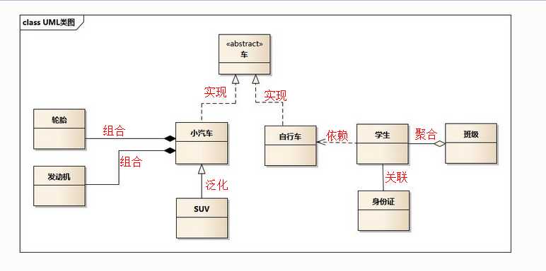

# uml类图

## quick start

## 类关系

*   泛化关系(generalization), 代码中表现为`继承非抽象类`, 图示中表现为`三角箭头空心, 实线`, 如: a继承自b(箭头从a指向b)
*   实现关系(realize), 代码中为`继承抽象类or接口`, 图示中为`三角空心箭头, 虚线`, 如: a实现b接口or抽象类(箭头从a指向b)
*   聚合关系(aggregation), 代码中表现为`多个a组成的list是b的一个属性`, 图示中为`菱形空心箭头, 实线`, 如: 多个a组成b(箭头从a指向b)
*   组合关系(composition), 代码表现`和聚合关系类似`, 图示中为`菱形实心箭头, 实线`,不同的是聚合是弱依赖, 例如部门和人员, 部门撤了, 人员还存在; 而组合关系是强依赖, 例如公司和部门, 公司倒闭, 部门必然消失, 如: 多个部门组成公司(箭头从部门指向公司)
*   依赖关系(dependency), 代码中为`类方法中的传入参数`, 图示中为`虚线简单箭头`, 如: a中方法传入参数有b(箭头从a指向b); 杜绝双向依赖
*   关联关系(association), 代码中为`成员变量`, 图示中为`实线`

